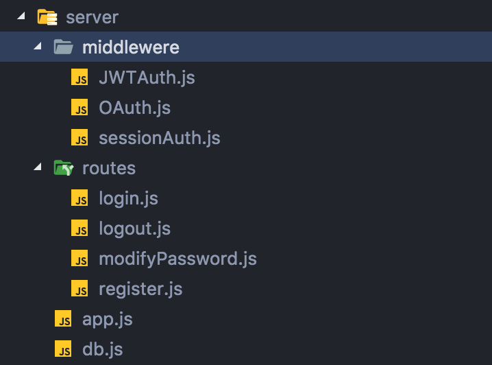
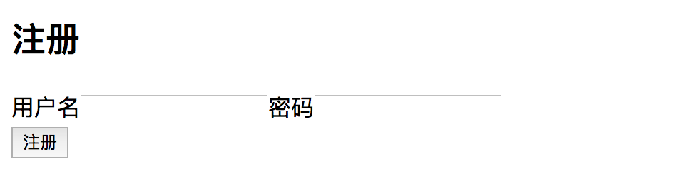
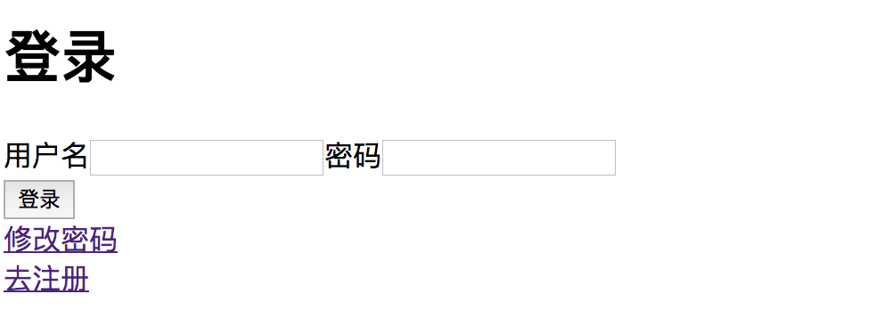
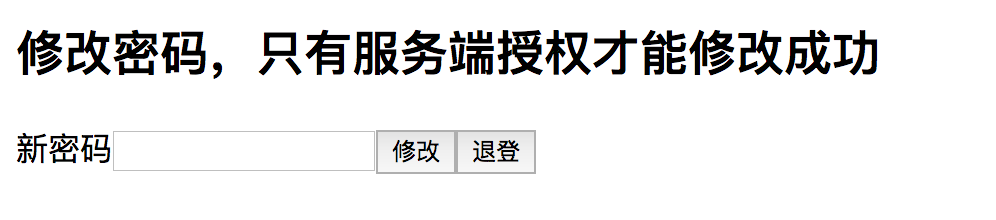
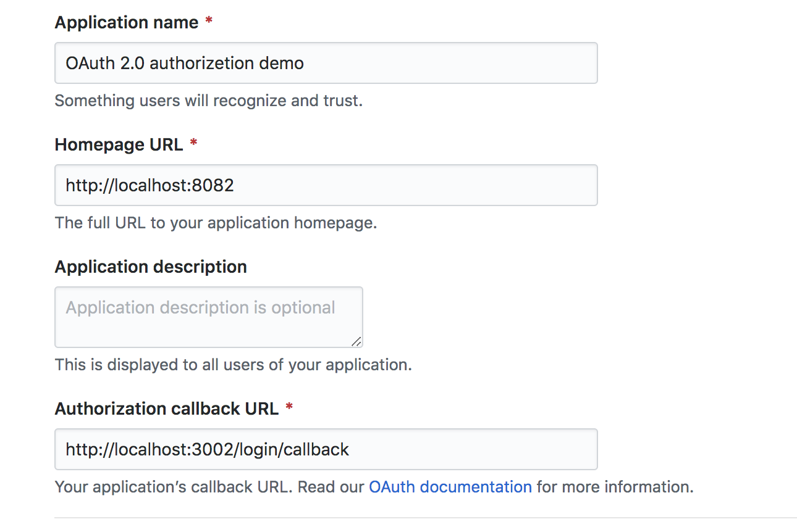
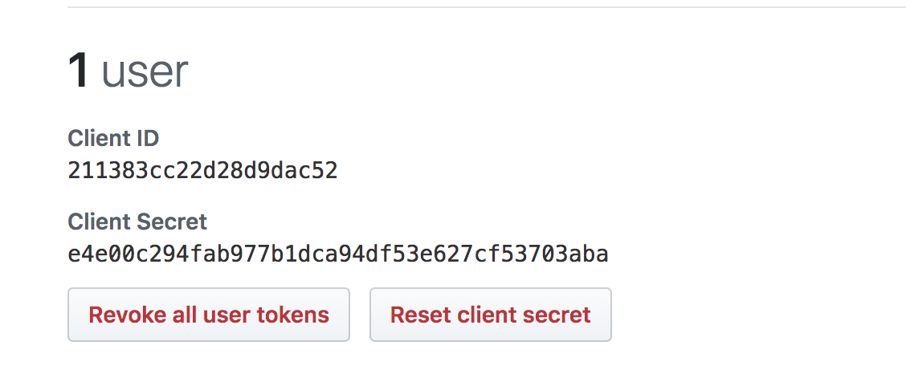
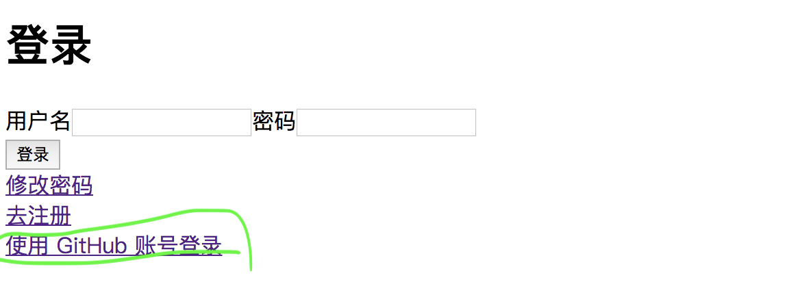

# JWT、OAuth 2.0、session 用户授权实战

>在很多应用中，我们需要向服务端提供自己的身份凭证来获得访问一些非公开资源的授权。比如在一个博客平台，我们要修改自己的博客，那么服务端要求我们能够证明  “我是我” ，才会允许我们修改自己的博客。

为用户提供授权以允许用户操作非公开资源，有很多种方式。比如使用 token、session、cookie，还有允许第三方登录授权的 OAuth 2.0.

为了理解这些技术的机制和它们之间的关系，本文就来一一使用这些方案实现一个前端通过后端验证授权来访问后端服务的应用。

我们将用 express 搭建一个简单的后端，为了保存用户信息，我们使用 mongoDB。前端是一个注册页面和一个登录页面，此外还有一个修改用户密码的页面，在这个页面上修改密码的操作只有在用户登录之后才被允许，也就是被服务端授权之后才能修改密码，否则返回 401 未授权。

下面就是我们这个简单 demo 的文件结构：

*服务端结构：*



*前端页面结构：*


如上图，我们在服务端写了4个路由分别用于用户注册、登录、修改密码、和登出。其中在登录路由中，用户登录之后将会生成一个用户凭证，在后续修改密码的路由中将会利用这个凭证来授权用户修改密码。具体的代码根据不同的授权方案而有所不同。前端相应地分为注册、登录、修改密码 3 个页面：







我们最终实现的效果就是：


搭建起一个前后端分离的应用框架之后，我们下面依次使用 token、OAuth 2.0、express-session 来实现用户授权。

## 1. 使用 session 授权
###  1.1 session 原理：
利用 session 来验证用户，有两种机制实现。
 
>1. 需要服务端在用户登录成功后生成一个 session ID 保存在服务端，这个session ID 标识当前会话的用户，以后用户的每一次请求中都会包含session ID，服务端可以识别这个 session ID 验证用户身份然后才会授权。

>2. 把 session ID 和其他数据加密后发给用户，由用户来存储并在以后每次请求中发给服务端来验证。比如可以用 cookie 存储发送，也可以使用其他客户端存储。


###  1.2 express-session API：
本文使用 express-session 来实现。并且使用上述 session 的第一种机制。所以先来看一下 [express-session](https://www.npmjs.com/package/express-session) 主要的 API：

- **session( options )**：生成 session 中间件，使用这个中间件会在当前会话中创建 session，session 数据将会被保存在服务端，而 session ID 会保存在 cookie。options 为传入的配置参数，有以下这些参数：

      1.  cookie：
             存储 session ID，
             默认值 { path: ‘/‘, httpOnly: true,secure: false, maxAge: null }）
      2.  genid：
             一个函数，返回一个字符串用来作为新的 session ID，传入 req 可以按需在 req 上添加一些值。
      3.  name：
             存储 session ID 的 cookie 的名字，默认是'connect.sid'，但是如果有多个使用 express-session 的 app 运行在同一个服务器主机上，需要用不同的名字命名  express-session 的 cookie。
      4.  proxy ：
             当设置了secure cookies（通过”x-forwarded-proto” header ）时信任反向代理。
      5.  resave：
             强制保存会话，即使会话在请求期间从未被修改过
      6.  rolling：
             强制在每次响应时，都设置保存会话标识符的cookie。cookie 到期时间会被重置为原始时间 maxAge。默认值为`false`。
      7.  saveUninitialized：
             默认 `true`, 强制存储未初始化的 session。
      8.  secret ( 必需 ）:
             用来对session ID cookie签名，可以提供一个单独的字符串作为 secret，也可以提供一个字符串数组，此时只有第一个字符串才被用于签名，但是在 express-session 验证 session ID   的时候会考虑全部字符串。 
      9.  store:
             存储 session 的实例。
      10. unset：
             控制 req.session 是否取消。默认是 `keep`，如果是  `destroy`,那么 session 就会在响应结束后被终止。
             
- **req.session**：这是 express-session 存放 session 数据的地方，注意，只有 session ID 存储在 cookie，所以 express-session 会自动检查 cookie 中的 session ID ，并用这个 session ID 来映射到对应的 session 数据，所以使用 express-session 时我们只需读取 req.session ，express-session 知道应该读取哪个 session ID 标识的 session 数据。
  
      1. 可以从 req.session 读取 session ：
             req.session.id：每一个 session 都有一个唯一ID来标识，可以读取这个ID，而且只读不可更改，这是 req.sessionID 的别名；
             req.session.cookie：每一个 session 都有一个唯一 的cookie来存储 session ID，可以通过 req.session.cookie 来设置 cookie 的配置项，比如 req.session.cookie.expires 设置为 false ，设置 req.session.cookie.maxAge 为某个时间。
      2. req.session 提供了这些方法来操作 session：
             req.session.regenerate( callback (err) ): 生成一个新的 session, 然后调用 callback；
             req.session.destroy( callback (err) ): 销毁 session，然后调用 callback；
             req.session.reload( callback (err) ):  从 store 重载 session 并填充 req.session ，然后调用 callback；
             req.session.save( callback (err) ): 将 session 保存到 store，然后调用 callback。这个是在每次响应完之后自动调用的，如果 session 有被修改，那么 store 中将会保存新的 session；
             req.session.touch(): 用来更新 maxAge。

- **req.sessionID**：和 req.session.id 一样。
- **store**：如果配置这个参数，可以将 session 存储到 redis和mangodb 。[一个使用 rtedis 存储 session 的例子](https://github.com/tj/connect-redis)。store 提供了一下方法来操作 store：

      1. store.all( callback (error, sessions) ) ：
             返回一个存储store的数组；
      2. store.destroy(sid, callback(error))：
             用session ID 来销毁 session；
      3. store.clear(callback(error))：
             删除所有 session
      4. store.length(callback(error, len))：
             获取 store 中所有的 session 的数目
      5. store.get(sid, callbackcallback(error, session))：
             根据所给的 ID 获取一个 session
      6. store.set(sid, session, callback(error))：
             设置一个 session。
      7. store.touch(sid, session, callback(error))：
              更新一个 session

以上就是 express-session 的全部 API。

### 1.3 使用 express-session
*重点中的重点，巨坑中的巨坑*：使用 express-session 是依赖于 cookie 来存储 session ID 的，而 session ID 用来唯一标识一个会话，如果要在一个会话中验证当前会话的用户，那么就要求用户前端能够发送 cookie，而且后端能够接收 cookie。所以前端我们设置 axios 的 withCredentials = true 来设置 axios 可以发送 cookie，后端我们需要设置响应头 Access-Control-Allow-Credentials:true，并且同时设置 Access-Control-Allow-Origin 为前端页面的服务器地址，而不能是` * `。我们可以用 cors 中间件代替设置：
```js
// 跨域

app.use(cors({
  credentials:  true,
  origin:  'http://localhost:8082',  // web前端服务器地址，，不能设置为 * 

}))
```
我开始就是因为没有设置这个，所以遇到了问题，就是后端登录接口在session中保存 用户名（ `req.session.username = req.body.username`） 之后，在修改用户密码的接口需要读取  `req.session.username` 以验证用户的时候读取不到 `req.session.username` ，很明显两个接口的 `req.session` 不是同一个 `session`，果然 console 出来 的 `session ID` 是不同的。这就让我想到了 cookie，cookie 是生成之后每次请求都会带上并且后端可以访问的，现在存储在 cookie 中的 session ID 没有被读取到而是读取到了新 session ID，所以问题就出在后端不能拿到 cookie，也有可能是因为前端发送不出去 cookie。可是开始的时候搜索关于 session ID 读取不一致的这个问题我找不到解决办法，而且发现很多人存在同样的问题，但是没有人给出答案，现在通过自己的思考想到了解决办法，这是很多人需要避免的巨坑。

现在跨过了最大的一个坑，我们就可以来编写前后端所有的逻辑了。关于注册的逻辑，是一个很简单的用户注册信息填写页面，它发送用户的名字和密码到后端注册接口，后端注册接口保存用户的名字和密码到数据库理。因此我在这里省略掉前端注册页面和后端注册接口，只讲前端登录页面和后端登录接口，前端修改密码页面和后端修改密码接口和登出接口。


- 1. 前端登录接口：

```js
async function login(){ // 登录
         
        let res = await axios.post('http://localhost:3002/login',{username,password})
        if(res.data.code === 0){
            setLoginSeccess(true)
            alert('登录成功,请修改密码')
            
        }else if(res.data.code === 2){
            alert('密码不正确')
            return
        }else if(res.data.code === 1){
            alert('没有该用户')
            return
        }
    }
```
- 2. 后端登录接口：

```js
const getModel = require('../db').getModel
const router = require('express').Router()
const users = getModel('users')

router.post('/', (req,res,next)=>{
    let {username, password} = req.body
    users.findOne({username},(err,olduser)=>{
        if(!olduser){
            res.send({code:1})// 没有该用户
        }else{
            if(olduser.password === password){// 登陆成功，生成 session
                req.session.username = olduser.username
                req.session.userID = olduser._id
                console.log('登录时的会话 ID：',req.sessionID)
                req.session.save()
                res.send({code:0})// 登录成功
            }else{

                res.send({code:2}) // 密码错误
            }
        }
    })
})

module.exports = router
```
- 3. 前端修改密码和登出页面：
```js
// src/axios.config.js:

// 支持 express-session 的 axios 配置
export function axios_session(){
    axios.defaults.withCredentials = true
    return axios
}
```


```js
async function modify(){ // 修改密码
       if(!input.current.value) return alert('请输入新密码')
       try{
           // 支持 session 的 axios 调用
           let res = await axios_session().post('http://localhost:3002/modify',{newPassword:input.current.value})
           if(res.data.code === 0)
               alert('密码修改成功')
       }catch(err){
           alert('没有授权 401')  
           console.log(err)
       }
}
```

```js
async function logout(){ // 登出
        let res = await axios.post('http://localhost:3002/logout')
        if(res.data.code === 0){
            history.back()
        }
}
```

- 4. 后端修改密码接口：

```js
const getModel = require('../db').getModel
const router = require('express').Router()
const users = getModel('users')
const sessionAuth = require('../middlewere/sessionAuth') 

router.post('/', sessionAuth, (req,res,next)=>{
    let {newPassword} = req.body
    console.log('修改密码时的会话 ID：',req.session.id)
    if(req.session.username){
        users.findOne({username: req.session.username},(err,olduser)=>{
            olduser.password = newPassword
            olduser.save(err=>{
                if(!err){
                    res.send({code:0})// 修改密码成功
                }
            })
        })
    }
})

module.exports = router
```
sessionAuth 验证中间件：
```js
const sessionAuth = (req,res,next)=>{
    if(req.session && req.session.username){// 验证用户成功则进入下一个中间件来修改密码
        next()
    }else{// 验证失败返回 401
        res.sendStatus(401)
    }
}

module.exports = sessionAuth
```

- 5. 后端登出：

```js
const router = require('express').Router()
 
router.post('/', (req,res,next)=>{
    req.session.destroy(()=>console.log('销毁session，已经推出登录'))
    res.send({code:0})
})

module.exports = router
```
我们还需要调用 session 的中间件，配置一些参数，才能在之后的中间件中使用 req.session 来进行存储、读取和销毁 session 的操作：
```js
// server/app.js:

// session
app.use(session({
    secret: '123456789',// 必需，用来签名 session
    unset:'destroy',// 在每次会话就熟后销毁 session
    resave:true,
    saveUninitialized:false,
    rolling:true,
    cookie:{
        maxAge:60*60*1000// session ID 有效时间
    }

}))
```

## 2. 使用 JWT 授权
### 2.1 JWT 的原理：
首先来看看 JWT 的概念，JWT 的 token 由 头部(head)、数据(payload)、签名(signature) 3个部分组成 具体每个部分的结构组成以及JWT更深的讲解可以看看[这个](https://auth0.com/learn/json-web-tokens/)。其中头部（header）和数据（payload）经过 base64 编码后经过秘钥 secret的签名，就生成了第三部分----签名(signature) ，最后将 base64 编码的 header 和 payload 以及 signature 这3个部分用圆点 . 连接起来就生成了最终的 token。

      signature = HMACSHA256(base64UrlEncode(header) + "." + base64UrlEncode(payload), secret)
      token = base64UrlEncode(header) + "." + base64UrlEncode(payload) + signature

token 生成之后，可以将其发送给客户端，由客户端来存储并在以后每次请求中发送会后端用于验证用户。前端存储和发送 token 的方式有以下两种：

#### 2.1.1 使用 Header.Authorization + localStorage 存储和发送 token
在 localStorage 中存储 token，通过请求头 Header 的 Authorization 字段将 token发送给后端。
	
这种方法可以避免 CSRF 攻击，因为没有使用 cookie ，在 cookie 中没有 token，而 CSRF 就是基于 cookie 来攻击的。虽然没有 CSRF ，但是这种方法容易被 XSS 攻击，因为 XSS 可以攻击 localStorage ，从中读取到 token，如果 token 中的 head 和 payload 部分没有加密，那么攻击者只要将 head 和 payload 的 base64 形式解码出来就可以看到head 和payload 的明文了。这个时候，如果 payload 保护敏感信息，我们可以加密 payload。 

#### 2.1.2 使用 cookie 存储和发送 token：
在这种情况下，我们需要使用 httpOnly 来使客户端脚本无法访问到 cookie，才能保证 token 安全。这样就避免了 CSRF 攻击。

### 2.2 使用 jsonwebtoken 来实现 JWT 用户授权：
[jsonwebtoken](https://www.npmjs.com/package/jsonwebtoken) 主要 API：
#### 1. **jwt.sign(payload, secretOrPrivateKey, [options, callback]) 用于签发 token**

如果有 callback 将异步的签名 token。

payload 就是我们要在 token 上装载的数据，比如我们可以在上面添加用户ID，用于数据库查询。payload可以是一个object, buffer或者string，payload 如果是 object，可以在里面设置 exp 过期时间。

secretOrPrivateKey 即包含HMAC算法的密钥或RSA和ECDSA的PEM编码私钥的string或buffer，是我们用于签名 token 的密钥，secretOrPublicKey 应该和下面 的 jwt.verify 的 secretOrPublicKey 一致。

options 的参数有：

      1）algorithm (default: HS256) 签名算法，这个算法和下面将要讲的 jwt.verify 所用的算法一个一致
      2）expiresIn: 以秒表示或描述时间跨度zeit / ms的字符串。如60，"2 days"，"10h"，"7d"，含义是：过期时间
      3）notBefore: 以秒表示或描述时间跨度zeit / ms的字符串。如：60，"2days"，"10h"，"7d"
      4）audience：Audience，观众
      5）issuer: Issuer，发行者
      6）jwtid: JWT ID
      7）subject: Subject，主题
      8）noTimestamp:
      9）header
      10）keyid
      11）mutatePayload

#### 2. **jwt.verify(token, secretOrPublicKey, [options, callback]) 用于验证 token**

如果有 callback 将异步的验证 token。

token 便是我们保存在前端的token，我们将它发送给后端，后端调用 jwt.verify 并接受 token 和传入放在后端的 secretOrPublicKey 来验证 token。注意这里的 secretOrPublicKey 与之前用于签发 token 的 secretOrPublicKey 应该是同一个。

options 的参数有：

      1）algorithms: 一个包含签名算法的数组，比如  ["HS256", "HS384"].
      2）audience: if you want to check audience (aud), provide a value here. The audience can be checked against a string, a regular expression or a list of strings and/or regular expressions.
      Eg: "urn:foo", /urn:f[o]{2}/, [/urn:f[o]{2}/, "urn:bar"]

      3）complete: return an object with the decoded { payload, header, signature } instead of only the usual content of the payload.
      4）issuer (optional): string or array of strings of valid values for the iss field.
      5）ignoreExpiration: if true do not validate the expiration of the token.
      6）ignoreNotBefore...
      7）subject: if you want to check subject (sub), provide a value here
      8）clockTolerance: number of seconds to tolerate when checking the nbf and exp claims, to deal with small clock differences among different servers
      9）maxAge: the maximum allowed age for tokens to still be valid. It is expressed in seconds or a string describing a time span zeit/ms.
      Eg: 1000, "2 days", "10h", "7d". A numeric value is interpreted as a seconds count. If you use a string be sure you provide the time units (days, hours, etc), otherwise milliseconds unit is used by default ("120" is equal to "120ms").

      10）clockTimestamp: the time in seconds that should be used as the current time for all necessary comparisons.
      11）nonce: if you want to check nonce claim, provide a string value here. It is used on Open ID for the ID Tokens. (Open ID implementation notes)

#### 3. **jwt.decode(token [, options]) 解码 token**

只是解码 token 中的 payload，不会验证 token。
options 参数有:

      1）json: 强制在 payload 用JSON.parse 序列化，即使头部没有声明 "typ":"JWT"  
      2）complete: true 则返回解码后的包含  payload 和 header  的对象.

#### 4. **错误码**

在验证 token 的过程中可能或抛出错误，jwt.verify() 的回调的第一个参数就是 err,err 对象有一下几种类型：

1. **TokenExpiredError:**
```js
   err = {
        name: 'TokenExpiredError',
        message: 'jwt expired',
        expiredAt: 1408621000
      }
```
2. **JsonWebTokenError：**
```js
err = {
        name: 'JsonWebTokenError',
        message: 'jwt malformed'
        /*
          message 有以下几个可能的值：
            'jwt malformed'
            'jwt signature is required'
            'invalid signature'
            'jwt audience invalid. expected: [OPTIONS AUDIENCE]'
            'jwt issuer invalid. expected: [OPTIONS ISSUER]'
            'jwt id invalid. expected: [OPTIONS JWT ID]'
            'jwt subject invalid. expected: [OPTIONS SUBJECT]'
      */
      }
```
3. **NotBeforeError：**
```js
err = {
        name: 'NotBeforeError',
        message: 'jwt not active',
        date: 2018-10-04T16:10:44.000Z
      }
```

#### 5. jsonwebtoken 的签名算法
HS256、HS384、HS512、RS256 等。

### 2.3 开始使用 jsonwebtoken：

后端登录接口现在需要改用 JWT 来签发 token，把原来使用 express-session 的代码去掉：
```js
if(olduser.password === password){// 密码正确
 
                /*
                
                // 授权方法 1. session 
                req.session.username = olduser.username
                req.session.userID = olduser._id
                console.log('登录时的会话 ID：',req.sessionID)
                req.session.cookie.maxAge = 60*60*1000
                req.session.save()
                res.send({code:0})// 登录成功

                */

                // 授权方法 2. JWT
                let token = JWT.sign(
                    {username:olduser.username, exp:Date.now() + 1000 * 60}, // payload
                    secret, // 签名密钥
                    {algorithm} // 签名算法
                )
                res.send({
                    code:0,
                    token
                })
                
            }else{

                res.send({code:2}) // 密码错误
            }

```

后端给前端发回了 token，前端需要存储 token 以便于后续请求授权，可以存储在 localStorage ,在修改密码页面再取出 localStorage 中 的 token，并再 axios 发送请求之前拦截请求，在请求头的 Authorization 中带上 token：

前端存储 token：
```js
// src/pages/login.js:

alert('登录成功,请修改密码')
localStorage.setItem('token',res.data.token)
```

前端拦截 axios 请求，从 localStorage 中取出保存好的 token，在请求头带上 token：

```js
// src/axios.config.js:

// 支持 JWT 的 axios 配置
export  function axios_JWT(){
    axios.interceptors.request.use(config => {
        // 在 localStorage 获取 token
        let token = localStorage.getItem("token");
        console.log('axios配置:token',token)
        // 如果存在则设置请求头
        if (token) {
            config.headers['Authorization'] = token;
            console.log(config)
        }
        return config;
    });
    return axios
}

```
前端修改密码页面调用可以拦截请求的 aios 来发送修改密码的请求：

```js
// src/pages/ModifyUserInfo.js:

 // 支持 JWT 的 axios 调用
           let res = await axios_JWT().post('http://localhost:3002/modify',{newPassword:input.current.value})
```

后端修改密码接口调用 JWT 的用户认证中间件：

认证中间件：
```js
const JWT = require('jsonwebtoken')
const secret = require('../server.config').JWT_config.secret
const algorithm = require('../server.config').JWT_config.algorithm


function JWT_auth(req,res,next){
    let authorization = req.headers["authorization"]
    console.log('authorization',authorization)
    if(authorization)
    try{
        let token = authorization;
        JWT.verify(token,secret,{algorithm:'HS256'},(err,decoded)=>{ // 用户认证
            if(err){
                console.log(err)
                next(err)
            }else{
                console.log(decoded)
                req.username = decoded.username // 在 req 上添加 username,以便于传到下一个中间件取出 username 来查询数据库
                next()
            }
        })

    }catch(err){
        res.status(401).send("未授权");
    }
    else
    res.status(401).send("未授权");
}
module.exports = JWT_auth
```

## 3. 使用 OAuth 2.0 授权：
### 3.1 OAuth 2.0 是什么
有的应用会提供第三方应用登录，比如掘金 web 客户端提供了微信、QQ账号登录，我们可以不用注册掘金账号，而可以用已有的微信账号登录掘金。看看用微信登录掘金的过程：

>step1: 打开掘金，未登录状态，点击登录，掘金给我们弹出一个登录框，上面有微信、QQ登录选项，我们选择微信登录；<br/>
step2: 之后掘金会将我们重定向到微信的登录页面，这个页面给出一个二维码供我们扫描，扫描之后；<br/>
step3: 我们打开微信，扫描微信给的二维码之后，微信询问我们是否同意掘金使用我们的微信账号信息，我们点击同意；<br/>
step4: 掘金刚才重定向到微信的二维码页面，现在我们同意掘金使用我们的微信账号信息之后，又重定向回掘金的页面，同时我们可以看到现在掘金的页面上显示我们已经处于登录状态，所以我们已经完成了用微信登录掘金的过程。<br/>

这个过程比我们注册掘金后才能登录要快捷多了。这归功于 OAuth2.0 ，它允许客户端应用（掘金）可以访问我们的资源服务器（微信），我们就是资源的拥有者，这需要我们允许客户端（掘金）能够通过认证服务器（在这里指微信，认证服务器和资源服务器可以分开也可以是部署在同一个服务上）的认证。很明显，OAuth 2.0 提供了4种角色，资源服务器、资源的拥有者、客户端应用 和 认证服务器，它们之间的交流实现了 OAuth 2.0 整个认证授权的过程。

OAuth 2.0 登录的原理，根据4中不同的模式有所不同。本文使用授权码模式，所以只讲授权码模式下 OAuth2.0 的登录过程，其他模式可以自行搜索学习。

### 3.2 使用 GitHub OAuth 来登录我们的项目客户端
可以参考[GitHub 官网](https://developer.github.com/apps/building-oauth-apps/authorizing-oauth-apps/)。
下面我们改用 OAuth2.0 来使用 GitHub 账号来授权我们上面的应用，从而修改我们应用的密码。

步骤：

1. 在 GitHub 上申请注册一个 OAuth application：https://github.com/settings/applications/new。
填写我们的应用名称、应用首页和授权需要的回调 URL：




2. 然后GitHub 生成了 Client ID 和 Client Secret：



3. 之后我们在我们原有的登录页面增加一个使用 GitHub 账号登录的入口：



这个登录入口其实就是一个指向GitHub铜壶登录页面的连接

```js
 <a href='https://github.com/login/oauth/authorize?client_id=211383cc22d28d9dac52'> 使用 GitHub 账号登录 </a>
```
4. 用户进入上面的 GitHub 登录页面之后，可以输入自己的GitHub用户名和密码登录，然后 GitHub 会将授权码以回调形式传回之前我们设置的 http://localhost:3002/login/callback 这个页面上，比如 http://localhost:3002/login/callback?code=37646a38a7dc853c8a77,
我们可以在 http://localhost:3002/login/callback 这个路由获取 code 授权码，并结合我们之前获得的 client-is、client_secret，向https://github.com/login/oauth/access_token请求token，token 获取之后，我们可以用这个 token向 https://api.github.com/user?access_token=用户的token 请求到用户的GitHub账号信息比如GitHub用户名、头像等等。

```js
// server/routes/login.js:

// 使用 OAuth2.0 时的登录接口，
router.get('/callback',async (req,res,next)=>{//这是一个授权回调，用于获取授权码 code
    var code = req.query.code; // GitHub 回调传回 code 授权码
    console.log(code)
    
    // 带着 授权码code、client_id、client_secret 向 GitHub 认证服务器请求 token
    let res_token = await axios.post('https://github.com/login/oauth/access_token',
    {
        client_id:Auth_github.client_id,
        client_secret:Auth_github.client_secret,
        code:code
    })
   console.log(res_token.data)

   let token = res_token.data.split('=')[1].replace('&scope','')
   

   // 带着 token 从 GitHub 获取用户信息
   let github_API_userInfo = await axios.get(`https://api.github.com/user?access_token=${token}`)
   console.log('github 用户 API：',github_API_userInfo.data)

   let userInfo = github_API_userInfo.data

   // 用户使用 GitHub 登录后，在数据库中存储 GitHub 用户名
   users.findOne({username:userInfo.name},(err,oldusers)=>{ // 看看用户之前有没有登录过，没有登录就会在数据库中新增 GitHub 用户
    if(oldusers) {
        res.cookie('auth_token',res_token.data)
        res.cookie('userAvatar',userInfo.avatar_url)
        res.cookie('username',userInfo.name)

        res.redirect(301,'http://localhost:8082') // 从GitHub的登录跳转回我们的客户端页面
        return
    }else
    new users({
        username:userInfo.name,
        password:'123', // 为使用第三方登录的能够用户初始化一个密码，后面用户可以自己去修改
    }).save((err,savedUser)=>{
        if(savedUser){
            res.cookie('auth_token',res_token.data)
            res.cookie('userAvatar',userInfo.avatar_url)
            res.cookie('username',userInfo.name)
         
            res.redirect(301,'http://localhost:8082') // 从GitHub的登录跳转回我们的客户端页面
        }
    })
   })
},
)
module.exports = router

```
在请求到用户的GitHub信息之后，我们可以将用户头像和用户名存在cookie、里，便于发送给前端在页面上显示出来，告诉用户他已经用GitHub账号登录了我们的客户端。
同时，我们把GitHub用户名存到我们自己的数据库里，并给一个‘123’简单的初始化密码，后面用户可以在获得权限后修改密码。

5. 接下来，我们使用GitHub登录后，我们需要获得授权以修改我们的密码。

我们使用和 JWT 一样的发送token的方式，前面我们从GitHub获得用户的token之后有已经用cookie的方式将其发送给前端，我们在前端可以读取cookie里的token，然后将其通过 Authorization 头方式给后端验证：

前端读取 token，并加到  Authorization 里：

```js
 // OAuth2.0
    axios.interceptors.request.use(config => {
        // 在 localStorage 获取 token
        let token = localStorage.getItem("token");
        console.log('axios配置:token',token)
        // 如果存在则设置请求头
        if(document.cookie){
            let OAtuh_token = unescape(document.cookie.split(';').filter(e=>/auth_token/.test(e))[0].replace(/auth_token=/,''))
            config.headers['Authorization'] = OAtuh_token;
            console.log(config)
        }
       
        return config;
    });
   
```

后端验证中间件 ：

```js
const axios = require('axios')

const OAuth=async (req,res,next)=>{
    let OAuth_token = req.headers["authorization"]
    console.log('authorization',OAuth_token)
    console.log('OAuth 中间件拿到cookie中的token：',OAuth_token)
    if(OAuth_token) {
        let token = OAuth_token.split('=')[1].replace('&scope','')
        let github_API_userInfo = await axios.get(`https://api.github.com/user?access_token=${token}`)
        let username = github_API_userInfo.data.name
        req.username = username
        next()
    }
    else res.status(401)
}
module.exports = OAuth
```

### 3.3 使用 GitHub OAuth2.0 登录授权的效果图：


## 总结
session、JWT、OAuth2.0 这三种授权方式每一种里面都会有其他方式的影子，主要是体现在用户凭证的存储和发送上，比如通常所说的基于服务端的 session，它可以把用户凭证，也就是 session ID 存储在服务端（内存或者数据库redis等），但是也是可以发给前端通过cookie保存的。JWT 可以把作为用户凭证的 token 在服务端签发后发给用户保存，可以在 localStorage 保存，同样也可以保存在 cookie 。OAuth2.0是比较复杂的一种授权方式，但是它后面获得 token 后也可以向 JWT 一样处理 token 的保存和验证来授权用户。

不管是哪种方式，都会有一些要注意的安全问题，还有性能上需要兼顾的地方。这里有关这方面不再赘述。

最后，本项目的地址：[https://github.com/qumuchegi/auth-demo](https://github.com/qumuchegi/auth-demo)